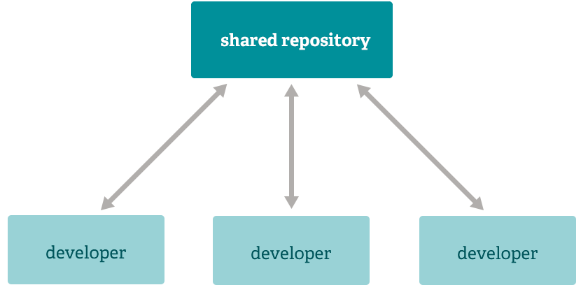

### Goal

> The target of this repository is to set up a collection for the lecture 'Data Structure', consisting of three components, i.e., *where to learn*, *basic concept*, *basic command*.

-------------------------------------
#### Where to Learn

> [Git Download](https://git-scm.com/downloads)

> [Turorial for Vim & Markdown & Linux(unix) command](https://baidu.com/)

> [Video for vim & Mardown & git](https://www.bilibili.com/)

> [Github](https://github.com/)

------------------------------------
#### Basic Concept

***Distributed*** : offline & online contibutes together.
* **Subversion-Style Workflow**
A centralized workflow is very common, especially from people transitioning from a centralized system. Git will not allow you to push if someone has pushed since the last time you fetched, so a centralized model where all developers push to the same server works just fine.

* **Intergration Manager Workflow**
Another common Git workflow involves an integration manager — a single person who commits to the 'blessed' repository. A number of developers then clone from that repository, push to their own independent repositories, and ask the integrator to pull in their changes. This is the type of development model often seen with open source or GitHub repositories.

* **Dictator and Lieutenants Workflow**
For more massive projects, a development workflow like that of the Linux kernel is often effective. In this model, some people ('lieutenants') are in charge of a specific subsystem of the project and they merge in all changes related to that subsystem. Another integrator (the 'dictator') can pull changes from only his/her lieutenants and then push to the 'blessed' repository that everyone then clones from again.

***Branching and Merging***: This means that you can do things like:
* **Frictionless Context Switching**. 
Create a branch to try out an idea, commit a few times, switch back to where you branched from, apply a patch, switch back to where you are experimenting, and merge it in.
Role-Based Codelines. Have a branch that always contains only what goes to production, another that you merge work into for testing, and several smaller ones for day to day work.

* **Feature Based Workflow.** 
Create new branches for each new feature you're working on so you can seamlessly switch back and forth between them, then delete each branch when that feature gets merged into your main line.

* **Disposable Experimentation.**
Create a branch to experiment in, realize it's not going to work, and just delete it - abandoning the work—with nobody else ever seeing it (even if you've pushed other branches in the meantime).

***Staging Area***
Unlike the other systems, Git has something called the "staging area" or "index". This is an intermediate area where commits can be formatted and reviewed before completing the commit.
One thing that sets Git apart from other tools is that it's possible to quickly stage some of your files and commit them without committing all of the other modified files in your working directory or having to list them on the command line during the commit.
This allows you to stage only portions of a modified file. Gone are the days of making two logically unrelated modifications to a file before you realized that you forgot to commit one of them. Now you can just stage the change you need for the current commit and stage the other change for the next commit. This feature scales up to as many different changes to your file as needed.

-----------------------------------------------------------
#### Basic Command
>> All refer to 
[link of git references](https://git-scm.com/docs)

* `git init`: Create an empty Git repository or reinitialize an existing one.

* `git add .`: Add file contents to the index.

* `git commit -m ''`: Record changes to the repository.

* `git status`: Show the working tree status.

* `git clone 'HTTPS/SSH'`: Clone the repostory in github to local.

* `git config --global user.name ''`, `git config --global user.email ''`: Get and set repository or global options.

* `git remote add origin 'HTTPS/SSH'`: Manage set of tracked repositories.

* `git pull origin branch`: Fetch from and integrate with another repository or a local branch.

* `git push origin branch`: Fetch from and integrate with another repository or a local branch.

* `git branch ''`: List, create, or delete branches.

* `git merge ''`: Join two or more development histories together.

* `git checkout branch`: Switch branches or restore working tree files.

